# TradeLens

[](https://github.com/DenisTc/trade_lens/actions/workflows/ci.yml)

Live crypto quotes, a candlestick chart drawn with `CustomPainter`, a manual
portfolio valued in real time, a server-driven "Insights" screen and an AI
move summary streamed from the Claude API. No backend: the phone talks to
Binance, CoinGecko and Anthropic directly.

> Status: data sources with region fallback and pinning, the WebSocket
> layer, markets list, pair screen with a CustomPainter chart, portfolio on
> Drift with offline valuation, locales en/ru, settings, the «Оптика»
> design (dark and light themes, glass tab bar, app icon), store
> screenshots, the server-driven Insights screen from Firebase Remote
> Config, the AI move summary on the user's own Claude API key. Next: deep
> links and attribution, Patrol e2e, Fastlane. See [the spec](docs/spec/tradelens-prd-tid-v1.2.md).

## Screens

Design direction «Оптика» (`docs/design/brief.md`): one brand mark, the
lens ring, that is also the app icon, the connection status, the selected
interval and the chart crosshair; Onest for text and IBM Plex Mono with
tabular figures for every number; one amber accent; rise and fall at the
same lightness; a floating glass tab bar the lists scroll under. Dark and
light themes follow the phone or a manual choice in Settings → Appearance.

| Markets | Pair: chart, order book, tape | Insights (server-driven) | Portfolio | Settings |
|---|---|---|---|---|
| 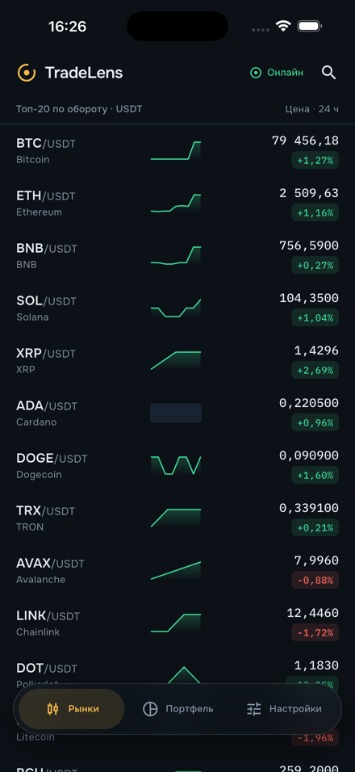 | 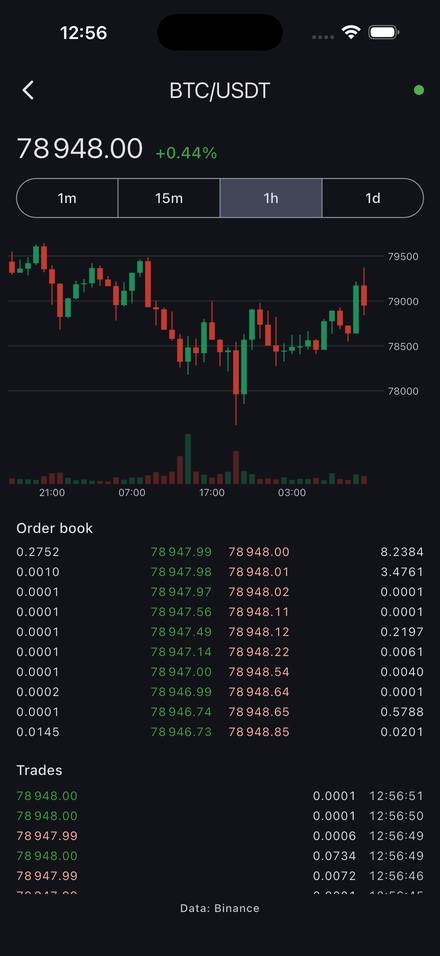 | 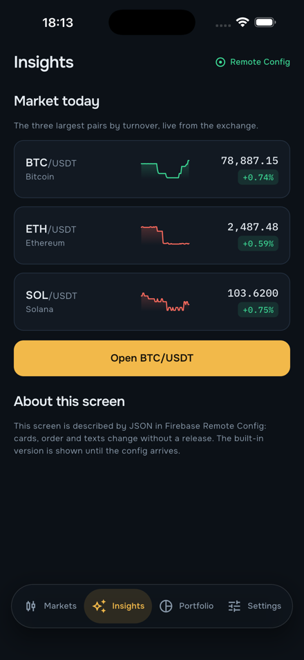 | 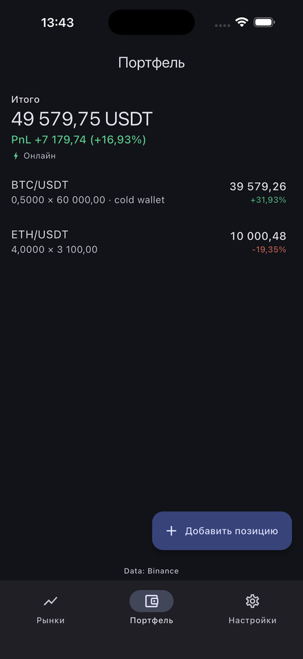 | 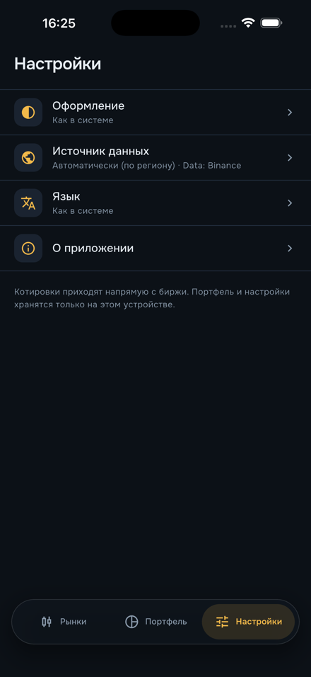 |

| Markets, light | Pair, light | Portfolio, light | Appearance |
|---|---|---|---|
| 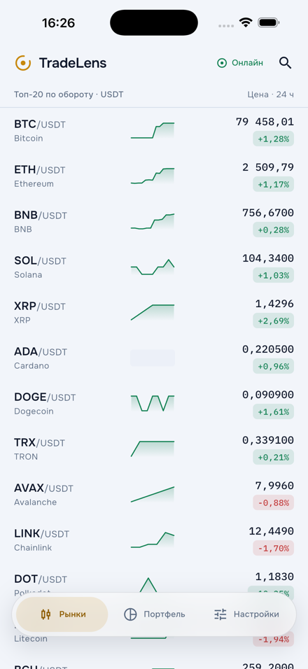 | 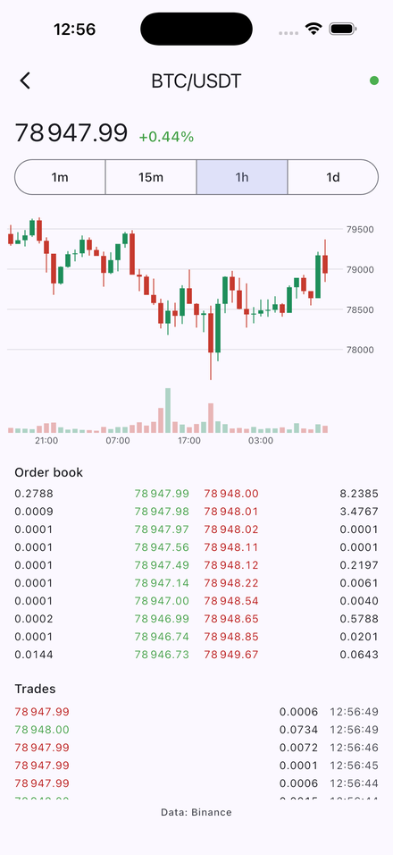 | 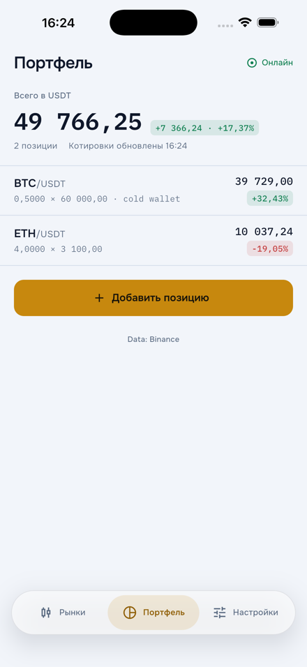 | 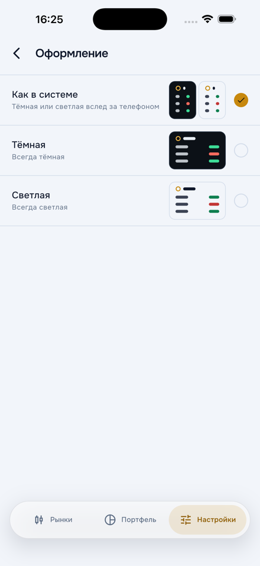 |

| AI move summary, dark | AI move summary, light |
|---|---|
| 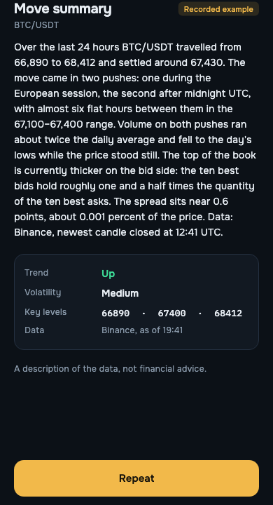 | 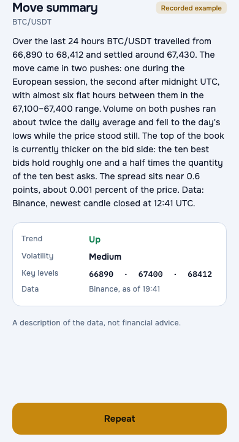 |

The two summary shots are the bundled recorded example, rendered by the
real widget in a golden test; the live feature runs on the user's own key.

Screenshots are from the iOS simulator on live Binance data (the simulator
runs in Russian; the app ships en and ru). Prices and the 24h change stream
over one WebSocket; the chart follows the newest candle, pans and
pinch-zooms, a long press shows the crosshair; the portfolio is valued on
every tick and falls back to the last stored quote ("as of HH:mm") offline.

## What this repository demonstrates

| Skill | Where |
|---|---|
| Riverpod 3 with codegen, DI without GetIt | `packages/features/shared`, `apps/mobile/lib/di` |
| WebSocket layer: registry, batching, reconnect, half-open detection | `packages/ws_client` |
| Custom candlestick chart on `CustomPainter` | `packages/chart` (two painters, goldens, benchmark) |
| Offline-first portfolio on Drift, Decimal money, tested v1→v2 migration | `packages/data_local`, `packages/domain/lib/src/portfolio` |
| Region fallback Binance → Binance US → CoinGecko | `packages/data_market/lib/src/region` |
| Remote Config + server-driven UI | `packages/sdui` (parser, allowlist, renderer), `packages/data_config` (Firebase Remote Config, realtime updates), `packages/features/insights` |
| Claude API: SSE streaming, tool use, structured output, cost accounting | `packages/ai_insights`, `packages/features/insights/lib/src/ai` |
| SSL pinning by SPKI, secure storage | `packages/data_market/lib/src/http`, secure storage with the AI feature |
| Deferred deep links, attribution, push | `apps/mobile` (next) |
| Design tokens as a `ThemeExtension`, bundled fonts, custom glass tab bar | `packages/features/shared/lib/src/theme`, `docs/design` |
| Unit / golden / Patrol tests, architecture tests | `tooling/arch_test`, `*/test` |
| GitHub Actions, Fastlane → TestFlight | `.github/workflows`, `tooling/fastlane` (next) |

## Layout

```
apps/mobile/            Flutter app: DI, routing, theme, locales
packages/
  core/                 Result, Decimal re-export, errors
  domain/               entities + repository interfaces, no dependencies
  data_market/          MarketDataSource: binance, binance_us, coingecko, region resolver
  data_local/           Drift: portfolio, candle cache, settings
  ws_client/            WebSocket with reconnect, subscription registry, batching
  chart/                CustomPainter engine (future pub.dev package)
  sdui/                 JSON schema + node renderer
  ai_insights/          Claude API client, tools, structured output
  features/shared/      Riverpod providers of the domain interfaces, shared widgets
  features/             markets, portfolio, insights, settings (UI + providers)
tooling/arch_test/      dependency-direction and coding-rule tests
docs/decisions/         ADRs, one file per decision
docs/spec/              PRD + TID this project implements
```

Dependency direction is enforced by tests, see
[ADR-0001](docs/decisions/0001-monorepo-layout.md).

## Getting started

```bash
fvm install            # reads .fvmrc (Flutter 3.47.2)
fvm use 3.47.2         # creates .fvm/flutter_sdk, the link IDEs use
dart pub global activate melos
melos bootstrap
sh tooling/scripts/firebase_stub.sh   # or `flutterfire configure` for real Remote Config
melos run generate     # build_runner in every package that needs it
melos run analyze
melos run test           # unit + widget tests
melos run test:golden    # golden tests, macOS only (CI renders them on macOS too)
cp env.example.json env.json   # fill in keys, never commit
cd apps/mobile && fvm flutter run --dart-define-from-file=../../env.json
```

Generated files (`*.g.dart`, `*.freezed.dart`, `*.drift.dart`) are not
committed; run `melos run generate` after cloning.

VS Code picks the SDK from `.vscode/settings.json` (`.fvm/flutter_sdk`);
the launch config runs `apps/mobile` with the example env file. If the IDE
reports "current Dart SDK version is 3.12.x", it is still on a global
Flutter: run `fvm use 3.47.2` and restart the analysis server.

To see which market data source your network gets (Binance, its
market-data host, Binance.US or the CoinGecko fallback):

```bash
cd packages/data_market && dart run tool/probe_sources.dart
```

## Decisions

- [ADR-0001 · Monorepo layout and layer rules](docs/decisions/0001-monorepo-layout.md)
- [ADR-0002 · Region fallback chain and pinning without a backend](docs/decisions/0002-region-fallback-and-pinning.md)
- [ADR-0003 · Who owns the interface providers; Riverpod auto-retry off](docs/decisions/0003-provider-ownership.md)
- [ADR-0004 · Storage on Drift, money as TEXT, migrations with a test](docs/decisions/0004-storage-and-migrations.md)
- [Backlog](docs/decisions/backlog.md): ideas go here, not into the code.

## Data sources and privacy

Market data comes from public Binance and CoinGecko endpoints; the exact
terms, attribution and the data flows (local cache, what is sent to the
Claude API and only on explicit user action) are described in the
[spec](docs/spec/tradelens-prd-tid-v1.2.md#условия-источников-что-можно-что-обязательно-что-проверить)
and will be restated here with a verification date before the first public
build. Nothing is traded, no exchange accounts, no wallets.

## Legal

[Privacy policy](https://denistc.github.io/trade_lens/privacy-policy) and
[terms of use](https://denistc.github.io/trade_lens/terms-of-use) are served
from `docs/` via GitHub Pages (enable Pages → `main` / `docs` once).

## License

MIT, see [LICENSE](LICENSE).

## Store screenshots

`docs/store/` holds framed screenshots for App Store (6.9″, 1320×2868) and
Google Play (1080×2340) in Russian and English, composed by
`docs/store/build.py` from simulator captures taken with
`--dart-define=TL_INITIAL_ROUTE=… --dart-define=TL_LOCALE=… --dart-define=TL_DEMO_PORTFOLIO=true`.

## Remote Config and the Insights screen

The Insights tab is described by JSON in Firebase Remote Config (key
`insights_screen`, schema 1, node types `header`, `text`, `ticker_card`,
`button`, `list`). `packages/sdui` parses it into a tree and renders it;
`packages/data_config` wraps Remote Config: defaults from the bundled
asset, one `fetchAndActivate` with a timeout, then `onConfigUpdated` so an
edit in the console shows up live. Buttons may only open routes from the
app's allowlist. A config that fails to parse keeps the previous screen and
is reported to Sentry; an unknown node type renders as a placeholder.

The Firebase configuration files are git-ignored, and the iOS project
references `GoogleService-Info.plist`, so a fresh clone needs one of the
two before the first build: `flutterfire configure` for the real files, or
`sh tooling/scripts/firebase_stub.sh` for stubs (CI does the latter; the
app then runs on the bundled screen). The template in
`apps/mobile/remoteconfig.template.json` is published with
`firebase deploy --only remoteconfig`.

## AI move summary

The pair screen can ask Claude to describe what the price and volume did.
It runs on **the user's own Anthropic API key**, kept in the device
keychain: there is no backend and no shared key, so nobody else pays for
it. The flow, in `packages/ai_insights` (pure Dart) and
`packages/features/insights/lib/src/ai` (UI):

- a consent screen before the first call names exactly what is sent (the
  candles and the top of the order book of the pair on screen);
- the model calls `get_klines` and `get_orderbook`, validated against the
  active source's instruments and intervals and answered from data the app
  already holds; the loop is capped at three iterations and a token budget;
- the prose streams into the sheet over SSE, then a second call with a JSON
  schema fills the block under it (trend, volatility, key levels, source
  and time);
- `usage` from both calls is priced with the rates in Remote Config
  (`ai_model`) and shown under the answer;
- 401 says "check the key", 429 says "wait", a dropped connection says
  "retry", and leaving the screen cancels the request;
- the remote flag `ai_insights_enabled` hides the button without a release;
- with no key the sheet plays a recorded example (bundled asset) so the
  feature can be shown and screenshotted without spending anything.

The key never reaches a log, a crash report or the Dio base options, and
the pin of `api.anthropic.com` is checked on a handshake of its own before
the first request, because Dio validates a certificate only once the
response is in. The residual gap (an interceptor that behaves differently
on the two connections) is written down in
[ADR-0002](docs/decisions/0002-region-fallback-and-pinning.md).

## Deep links

Two ways in, both handled by one validated mapper
(`apps/mobile/lib/deep_links.dart`), never by the framework's automatic
routing:

- `tradelens://p/BTCUSDT` — a custom scheme, so it works with no domain and
  no developer account. This is what the e2e test and a shared QR code use.
- `https://denistc.github.io/trade_lens/p/BTCUSDT` — the same route as a
  normal link, verified by `docs/.well-known/assetlinks.json` (Android App
  Links) and `docs/.well-known/apple-app-site-association` (iOS Universal
  Links), both served by GitHub Pages.

A link may only open routes on the same allowlist the server-driven buttons
use, so `/settings/ai` or another host cannot be opened from outside, and
the query string is dropped before navigating. Try it on a simulator:

```bash
xcrun simctl openurl booted "tradelens://p/ETHUSDT"        # iOS
adb shell am start -a android.intent.action.VIEW -d "tradelens://p/ETHUSDT"
```

Three honest limits, all about the https half; the custom scheme works
today on both platforms.

- **The verification files must sit at the domain root.** Both platforms
  fetch `https://denistc.github.io/.well-known/…`, and a project page is
  served under `/trade_lens/`, so the copies in `docs/.well-known/` are the
  content, not the live location. They go live once they are published from
  a user-site repository (`DenisTc.github.io`) or a custom domain.
- **Universal Links need a paid Apple Developer account.** The
  `applinks:` entitlement is in the project, on the Release configuration
  only, because a free personal team cannot sign it and a device build
  would stop working. Until then an https link opens the browser.
- **`assetlinks.json` carries a debug-keystore fingerprint**, which
  verifies development builds only. A Play-signed build needs its own
  fingerprint added to the list.

A **deferred** deep link (the link survives the trip through the store on a
first install) needs an attribution SDK such as AppsFlyer, which is not
wired up.
