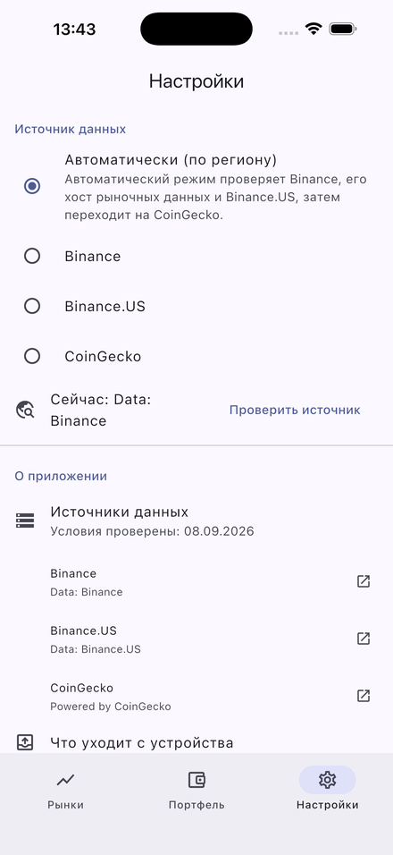

# TradeLens

[](https://github.com/DenisTc/trade_lens/actions/workflows/ci.yml)

Live crypto quotes, a candlestick chart drawn with `CustomPainter`, a manual
portfolio valued in real time, a server-driven "Insights" screen and an AI
move summary streamed from the Claude API. No backend: the phone talks to
Binance, CoinGecko and Anthropic directly.

> Status: **day 5 of 8** · data sources, region fallback, pinning, the
> WebSocket layer, markets list, pair screen with a CustomPainter chart,
> portfolio on Drift with offline valuation, locales en/ru, settings and
> About. Next: Remote Config + SDUI and the Claude API summary.
> See [the plan](docs/spec/tradelens-prd-tid-v1.2.md#план-по-дням).

## Screens

| Markets | Pair: chart, order book, tape | Portfolio | Settings & About |
|---|---|---|---|
|  |  |  |  |

| Pair, dark theme | Portfolio, dark theme |
|---|---|
|  |  |

Screenshots are from the iOS simulator on live Binance data (the simulator
runs in Russian; the app ships en and ru). Prices and the 24h change stream
over one WebSocket; the chart follows the newest candle, pans and
pinch-zooms, a long press shows the crosshair; the portfolio is valued on
every tick and falls back to the last stored quote ("as of HH:mm") offline.

## What this repository demonstrates

| Skill | Where |
|---|---|
| Riverpod 3 with codegen, DI without GetIt | `packages/features/shared`, `apps/mobile/lib/di` |
| WebSocket layer: registry, batching, reconnect, half-open detection | `packages/ws_client` |
| Custom candlestick chart on `CustomPainter` | `packages/chart` (two painters, goldens, benchmark) |
| Offline-first portfolio on Drift, Decimal money, tested v1→v2 migration | `packages/data_local`, `packages/domain/lib/src/portfolio` |
| Region fallback Binance → Binance US → CoinGecko | `packages/data_market/lib/src/region` |
| Remote Config + server-driven UI | `packages/sdui` (day 6) |
| Claude API: streaming, tool use, structured output | `packages/ai_insights` (day 6) |
| SSL pinning by SPKI, secure storage | `packages/data_market/lib/src/http`, secure storage on day 7 |
| Deferred deep links, attribution, push | `apps/mobile` (day 7) |
| Unit / golden / Patrol tests, architecture tests | `tooling/arch_test`, `*/test` |
| GitHub Actions, Fastlane → TestFlight | `.github/workflows`, `tooling/fastlane` (day 8) |

## Layout

```
apps/mobile/            Flutter app: DI, routing, theme, locales
packages/
  core/                 Result, Decimal re-export, errors
  domain/               entities + repository interfaces, no dependencies
  data_market/          MarketDataSource: binance, binance_us, coingecko, region resolver
  data_local/           Drift: portfolio, candle cache, settings
  ws_client/            WebSocket with reconnect, subscription registry, batching
  chart/                CustomPainter engine (future pub.dev package)
  sdui/                 JSON schema + node renderer
  ai_insights/          Claude API client, tools, structured output
  features/shared/      Riverpod providers of the domain interfaces, shared widgets
  features/             markets, portfolio, insights, settings (UI + providers)
tooling/arch_test/      dependency-direction and coding-rule tests
docs/decisions/         ADRs, one file per decision
docs/spec/              PRD + TID this project implements
```

Dependency direction is enforced by tests, see
[ADR-0001](docs/decisions/0001-monorepo-layout.md).

## Getting started

```bash
fvm install            # reads .fvmrc (Flutter 3.47.2)
fvm use 3.47.2         # creates .fvm/flutter_sdk, the link IDEs use
dart pub global activate melos
melos bootstrap
melos run generate     # build_runner in every package that needs it
melos run analyze
melos run test
cp env.example.json env.json   # fill in keys, never commit
cd apps/mobile && fvm flutter run --dart-define-from-file=../../env.json
```

Generated files (`*.g.dart`, `*.freezed.dart`, `*.drift.dart`) are not
committed; run `melos run generate` after cloning.

VS Code picks the SDK from `.vscode/settings.json` (`.fvm/flutter_sdk`);
the launch config runs `apps/mobile` with the example env file. If the IDE
reports "current Dart SDK version is 3.12.x", it is still on a global
Flutter: run `fvm use 3.47.2` and restart the analysis server.

To see which market data source your network gets (Binance, its
market-data host, Binance.US or the CoinGecko fallback):

```bash
cd packages/data_market && dart run tool/probe_sources.dart
```

## Decisions

- [ADR-0001 · Monorepo layout and layer rules](docs/decisions/0001-monorepo-layout.md)
- [ADR-0002 · Region fallback chain and pinning without a backend](docs/decisions/0002-region-fallback-and-pinning.md)
- [ADR-0003 · Who owns the interface providers; Riverpod auto-retry off](docs/decisions/0003-provider-ownership.md)
- [ADR-0004 · Storage on Drift, money as TEXT, migrations with a test](docs/decisions/0004-storage-and-migrations.md)
- [Backlog](docs/decisions/backlog.md): ideas go here, not into the code.

## Data sources and privacy

Market data comes from public Binance and CoinGecko endpoints; the exact
terms, attribution and the data flows (local cache, what is sent to the
Claude API and only on explicit user action) are described in the
[spec](docs/spec/tradelens-prd-tid-v1.2.md#условия-источников-что-можно-что-обязательно-что-проверить)
and will be restated here with a verification date before the first public
build. Nothing is traded, no exchange accounts, no wallets.

## Legal

[Privacy policy](https://denistc.github.io/trade_lens/privacy-policy) and
[terms of use](https://denistc.github.io/trade_lens/terms-of-use) are served
from `docs/` via GitHub Pages (enable Pages → `main` / `docs` once).

## License

MIT, see [LICENSE](LICENSE).
